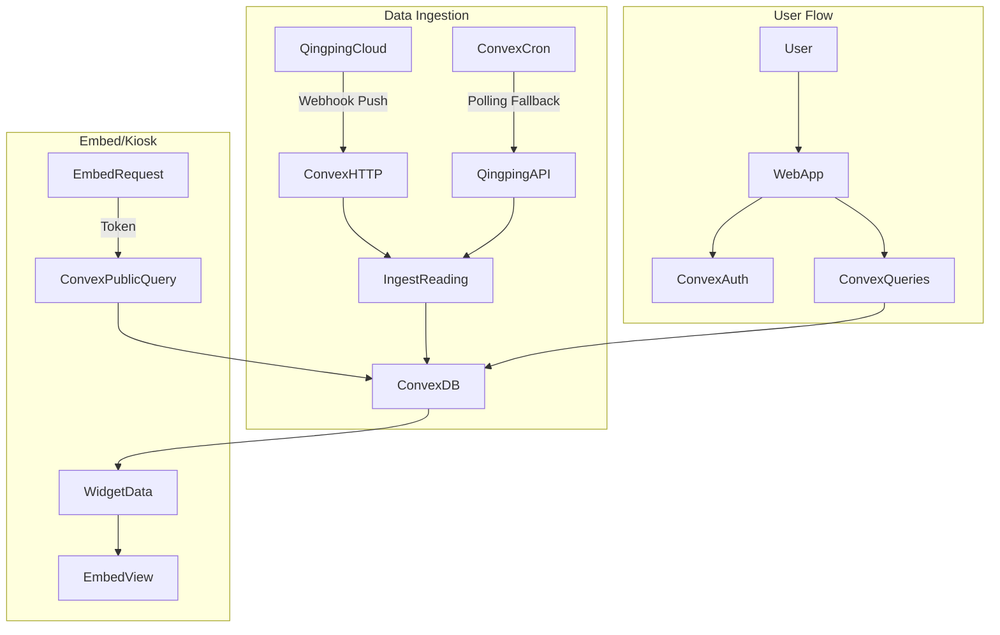

# Air Quality SaaS Plan (Detailed)

## Assumptions

- Next.js app exists in `sensor-dashboard-app` and Convex is the backend.
- Use Convex Auth initially (can swap later).
- Qingping API credentials are available; exact endpoints will be confirmed in docs.
- Users self-serve onboarding, with optional admin-assisted onboarding later.
- Initial UI is functional but minimal; visual polish can follow once data flow works.

## Success criteria (MVP)

- User can sign up, connect Qingping, and see a live reading in the dashboard.
- User can assign a room to a device and see it reflected in UI.
- User can generate an embed snippet and see the widget render for a device.
- Data ingestion is reliable within Qingping rate limits.

## Phase 0: Docs and decisions (highest) - COMPLETED

- Review Qingping API: auth, device list, latest + history endpoints, rate limits, push/poll support.
- Decide ingest model (polling vs push).
- Define provider-agnostic sensor data contract.

### Qingping API Summary (from developer.qingping.co)

#### Authentication

- **OAuth 2.0 Client Credentials** flow
- Requires **App Key** + **App Secret** (from Qingping Developer Portal)
- Access Token valid for **2 hours** - must refresh before expiry
- Token goes in `Authorization` header for all API calls

#### Open API Endpoints (Base URL: `https://apis.cleargrass.com`)

| Endpoint | Method | Description |
|----------|--------|-------------|
| `/v1/apis/device` | POST | Bind device to account (requires device_token, product_id) |
| `/v1/apis/device` | DELETE | Unbind device from account |
| `/v1/apis/device` | GET | **List devices with current readings** |
| `/v1/apis/devices/data` | GET | Historical data (time range params) |
| `/v1/apis/devices/event` | GET | Historical events/alerts |
| `/v1/apis/devices/setting` | PUT | Modify device settings (report_interval, collect_interval) |
| `/v1/apis/group` | GET | Get device groups |
| `/v1/apis/devices/profile/query` | POST | Get device profile by MAC address |

#### Data Fields Returned

**Device info:**
- `name`, `mac`, `version`, `created_at`, `group_id`, `group_name`
- `product.id`, `product.name`, `product.en_name`
- `status.offline` (bool)
- `setting.report_interval`, `setting.collect_interval` (seconds)

**Sensor readings (in `data` object):**
- `temperature` (°C), `humidity` (% RH), `pressure` (Pa)
- `co2` (ppm), `pm25` (μg/m³), `pm10` (μg/m³), `tvoc` (index)
- `battery` (%), `timestamp` (unix ms)
- Each reading has: `value`, `level`, `status`

#### Data Push (Webhooks/MQTT)

Qingping supports **near-real-time push** to your server:
- **Webhook**: Register a URL, Qingping POSTs data on change
- **MQTT**: Subscribe to topics for real-time updates
- Both require **signature verification** (HMAC)
- Push types: Device Data Push, Device Event Push

### Ingestion Decision: Hybrid (Push Primary + Polling Fallback)

| Use Case | Method | Reason |
|----------|--------|--------|
| Real-time readings | **Webhook push** | Near-instant, fewer API calls |
| Initial device sync | Polling (one-time) | Full device list on first connect |
| Historical data | Polling (on-demand) | User explicitly requests history |
| Fallback/recovery | Scheduled polling (cron) | If webhook misses data or fails |

**Convex Implementation Plan:**
- `convex/http.ts`: HTTP Action to receive Qingping webhooks
- `convex/crons.ts`: Cron job for periodic sync (every 5 min fallback)
- `convex/providers/qingping/client.ts`: OAuth token management + API calls

### Provider-agnostic data contract (finalized)

```typescript
// Device (normalized across providers)
type Device = {
  _id: Id<"devices">;
  userId: Id<"users">;
  roomId?: Id<"rooms">;
  provider: "qingping" | "purpleair" | "iqair" | "temtop";
  providerDeviceId: string;  // MAC for Qingping
  name: string;
  model?: string;
  timezone?: string;
  lastReadingAt?: number;
  createdAt: number;
};

// Reading (normalized sensor data)
type Reading = {
  _id: Id<"readings">;
  deviceId: Id<"devices">;
  ts: number;           // Unix timestamp ms
  pm25?: number;        // μg/m³
  pm10?: number;        // μg/m³
  co2?: number;         // ppm
  tempC?: number;       // Celsius
  rh?: number;          // % relative humidity
  voc?: number;         // index or ppb
  pressure?: number;    // Pa or hPa
  battery?: number;     // %
  aqi?: number;         // computed AQI
};

// Provider credentials (per user)
type ProviderConfig = {
  _id: Id<"providerConfigs">;
  userId: Id<"users">;
  provider: "qingping" | "purpleair" | "iqair" | "temtop";
  accessToken: string;
  refreshToken?: string;
  tokenExpiresAt: number;  // Unix timestamp
  appKey?: string;         // For Qingping
  appSecret?: string;      // For Qingping (encrypted)
  webhookSecret?: string;  // For verifying push signatures
  lastSyncAt?: number;
};
```

## Phase 1: Core backend (highest)

## Phase 1: Core backend (highest)

- Create Convex schema for users, rooms, devices, readings, provider credentials.
- Implement Qingping provider adapter mapping API data into the shared contract.
- Build ingestion:
  - Polling: scheduled jobs that fetch latest readings.
  - Push: Convex HTTP endpoint to receive callbacks.

### Convex schema (tables + fields)

```typescript
// convex/schema.ts
import { defineSchema, defineTable } from "convex/server";
import { v } from "convex/values";

export default defineSchema({
  users: defineTable({
    authId: v.string(),           // From Convex Auth
    email: v.string(),
    name: v.optional(v.string()),
    plan: v.union(v.literal("free"), v.literal("basic"), v.literal("pro"), v.literal("team")),
    createdAt: v.number(),
  }).index("by_authId", ["authId"]),

  rooms: defineTable({
    userId: v.id("users"),
    name: v.string(),
    createdAt: v.number(),
  }).index("by_user", ["userId"]),

  devices: defineTable({
    userId: v.id("users"),
    roomId: v.optional(v.id("rooms")),
    provider: v.union(v.literal("qingping"), v.literal("purpleair"), v.literal("iqair"), v.literal("temtop")),
    providerDeviceId: v.string(),  // MAC address for Qingping
    name: v.string(),
    model: v.optional(v.string()),
    timezone: v.optional(v.string()),
    lastReadingAt: v.optional(v.number()),
    createdAt: v.number(),
  })
    .index("by_user", ["userId"])
    .index("by_provider_device", ["provider", "providerDeviceId"]),

  readings: defineTable({
    deviceId: v.id("devices"),
    ts: v.number(),               // Unix timestamp ms
    pm25: v.optional(v.number()), // μg/m³
    pm10: v.optional(v.number()), // μg/m³
    co2: v.optional(v.number()),  // ppm
    tempC: v.optional(v.number()),// Celsius
    rh: v.optional(v.number()),   // % relative humidity
    voc: v.optional(v.number()),  // index
    pressure: v.optional(v.number()), // hPa
    battery: v.optional(v.number()),  // %
    aqi: v.optional(v.number()),  // computed
  })
    .index("by_device", ["deviceId"])
    .index("by_device_ts", ["deviceId", "ts"]),

  providerConfigs: defineTable({
    userId: v.id("users"),
    provider: v.union(v.literal("qingping"), v.literal("purpleair"), v.literal("iqair"), v.literal("temtop")),
    accessToken: v.string(),
    tokenExpiresAt: v.number(),
    appKey: v.optional(v.string()),
    appSecret: v.optional(v.string()),  // Consider encryption
    webhookSecret: v.optional(v.string()),
    lastSyncAt: v.optional(v.number()),
  })
    .index("by_user", ["userId"])
    .index("by_user_provider", ["userId", "provider"]),

  embedTokens: defineTable({
    deviceId: v.id("devices"),
    token: v.string(),            // Signed token for public access
    createdAt: v.number(),
    expiresAt: v.optional(v.number()),
  }).index("by_token", ["token"]),
});
```

### Convex functions (minimum set)

**Queries:**
- `devices:list(userId)` - List all devices for user
- `devices:get(deviceId)` - Get single device with latest reading
- `readings:latest(deviceId)` - Get most recent reading
- `readings:history(deviceId, startTs, endTs)` - Get historical readings
- `rooms:list(userId)` - List rooms for user
- `embed:getPublicData(token)` - Public query for embed widgets

**Mutations:**
- `rooms:create(name)` - Create a room
- `devices:add(provider, providerDeviceId, name, roomId?)` - Add device
- `devices:updateRoom(deviceId, roomId)` - Assign device to room
- `providers:connect(provider, appKey, appSecret)` - Store credentials
- `providers:disconnect(provider)` - Remove credentials
- `embed:generateToken(deviceId)` - Create public embed token

**Internal/Actions:**
- `providers:refreshToken(userId, provider)` - Refresh OAuth token
- `providers:syncDevices(userId)` - Fetch device list from provider
- `providers:pollReadings(userId)` - Fetch latest readings for all devices
- `readings:ingest(deviceId, reading)` - Store a reading (internal)

**HTTP Actions:**
- `POST /webhooks/qingping` - Receive Qingping data push

**Crons:**
- `tokenRefresh` - Every 90 min, refresh tokens expiring soon
- `readingsPoll` - Every 5 min, poll readings as fallback

### Provider adapter structure (Convex)

```
convex/
├── schema.ts
├── http.ts                      # HTTP endpoints for webhooks
├── crons.ts                     # Scheduled jobs
├── devices.ts                   # Device queries/mutations
├── readings.ts                  # Reading queries/mutations
├── rooms.ts                     # Room queries/mutations
├── providers.ts                 # Provider connection mutations
├── embed.ts                     # Embed token logic
└── providers/
    ├── types.ts                 # Shared provider interfaces
    ├── qingping/
    │   ├── client.ts            # OAuth + API request wrapper
    │   ├── mappers.ts           # Map Qingping → normalized format
    │   └── webhooks.ts          # Verify + parse webhook payloads
    ├── purpleair/               # Future
    ├── iqair/                   # Future
    └── temtop/                  # Future
```

### Qingping client implementation notes

```typescript
// convex/providers/qingping/client.ts (pseudocode)
const QINGPING_API_BASE = "https://apis.cleargrass.com";
const QINGPING_OAUTH_URL = "https://oauth.cleargrass.com/oauth2/token";

// Get access token (Client Credentials)
async function getAccessToken(appKey: string, appSecret: string) {
  const response = await fetch(QINGPING_OAUTH_URL, {
    method: "POST",
    headers: { "Content-Type": "application/x-www-form-urlencoded" },
    body: new URLSearchParams({
      grant_type: "client_credentials",
      scope: "device_full_access",
    }),
    // Basic auth with appKey:appSecret
  });
  const { access_token, expires_in } = await response.json();
  return { accessToken: access_token, expiresIn: expires_in };
}

// List devices with current readings
async function listDevices(accessToken: string) {
  const response = await fetch(`${QINGPING_API_BASE}/v1/apis/device`, {
    headers: { Authorization: `Bearer ${accessToken}` },
  });
  return response.json();
}

// Get historical data
async function getHistoryData(accessToken: string, mac: string, startTime: number, endTime: number) {
  const params = new URLSearchParams({
    mac,
    start_time: String(startTime),
    end_time: String(endTime),
  });
  const response = await fetch(`${QINGPING_API_BASE}/v1/apis/devices/data?${params}`, {
    headers: { Authorization: `Bearer ${accessToken}` },
  });
  return response.json();
}
```

## Phase 2: Auth + onboarding (high)

## Phase 2: Auth + onboarding (high)

- Add Convex Auth and protect queries/mutations.
- Build onboarding: connect Qingping → list devices → assign room.
- Error handling for auth/limits.

### Onboarding flow (first iteration)

- Step 1: Sign up / sign in
- Step 2: Connect Qingping account (store credentials)
- Step 3: Import device list → user selects devices to add
- Step 4: Assign room to device(s)

## Phase 3: Minimal dashboard UI (medium)

## Phase 3: Minimal dashboard UI (medium)

- shadcn layout: sidebar devices + tabs Overview/History/Compare/Settings/Account.
- Device detail view with current readings and last updated.

### UI components (initial)

- Sidebar: device list, add device button, room filters (optional).
- Main: device detail card with PM2.5, PM10, CO2, temp, humidity.
- Tabs: History (placeholder chart), Compare (placeholder), Settings, Account.

## Phase 4: Embed/Kiosk (medium)

## Phase 4: Embed/Kiosk (medium)

- Embeddable widget endpoint + snippet generation.
- Kiosk view variant.

### Embed details

- Generate a signed public token per device for read-only access.
- Embed snippet returns a script tag + iframe or a direct iframe URL.
- Kiosk view is a simplified fullscreen layout with auto-refresh.

## Phase 5: Billing (later)

## Phase 5: Billing (later)

- Stripe integration and plan limits enforcement.

### Plan enforcement examples

- Basic: max 1 device, 7 days history
- Pro: max 5 devices, 30 days history
- Team: unlimited devices, 365 days history

## Phase 6: Multi-brand expansion (ongoing)

- Provider adapter interface; add PurpleAir/IQAir/Temtop later.

## Key files

- `sensor-dashboard-app/convex/` for schema + functions.
- `sensor-dashboard-app/app/` for UI routes.
- `sensor-dashboard-app/convex/providers/` for provider adapters.

## Risks and mitigations

- Qingping rate limits: implement caching and backoff, avoid excessive polling.
- Credential handling: store securely and rotate tokens if required.
- Data gaps: mark readings with `lastReadingAt` and show stale data warning.

## Milestones

- M1: Qingping credentials stored + devices imported.
- M2: Latest readings ingested and viewable in dashboard.
- M3: Embed snippet renders live data.

## Architecture



### Webhook Setup Flow

1. User connects Qingping account in dashboard
2. System stores `appKey` + `appSecret` in `providerConfigs`
3. System calls Qingping API to register webhook URL: `https://<convex-deployment>.convex.site/webhooks/qingping`
4. Qingping starts pushing data to our endpoint
5. HTTP action verifies signature, parses payload, calls `ingestReading`

### Data Flow Summary

| Flow | Trigger | Action |
|------|---------|--------|
| Initial sync | User connects provider | Fetch device list, store in DB |
| Real-time | Qingping webhook | Parse + store reading |
| Fallback | Cron (every 5 min) | Poll API for latest readings |
| History request | User clicks History tab | Fetch from Qingping API on-demand |
| Embed view | Public request with token | Query latest reading from DB |

## Implementation Todos

- [x] **todo-1**: Review Qingping docs; decide polling vs push ingest. *(Completed - Hybrid approach: webhook push + polling fallback)*
- [ ] **todo-2**: Design Convex schema + provider data contract. *(Schema draft in this doc, ready to implement)*
- [ ] **todo-3**: Implement Qingping adapter + ingestion functions.
- [ ] **todo-4**: Build auth, onboarding, minimal dashboard shell.
- [ ] **todo-5**: Add embed/kiosk endpoint + snippet generation.

## Next Steps (Ready to Execute)

1. **Create Convex schema** (`convex/schema.ts`) using the schema draft above
2. **Set up Convex Auth** for user authentication
3. **Implement Qingping client** (`convex/providers/qingping/client.ts`)
4. **Create HTTP endpoint** for webhooks (`convex/http.ts`)
5. **Build device listing UI** with shadcn components
